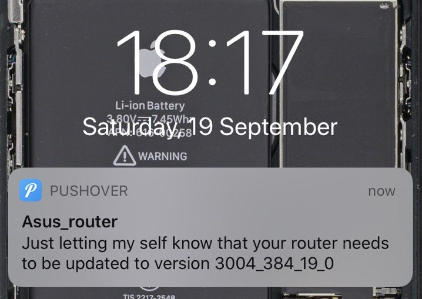
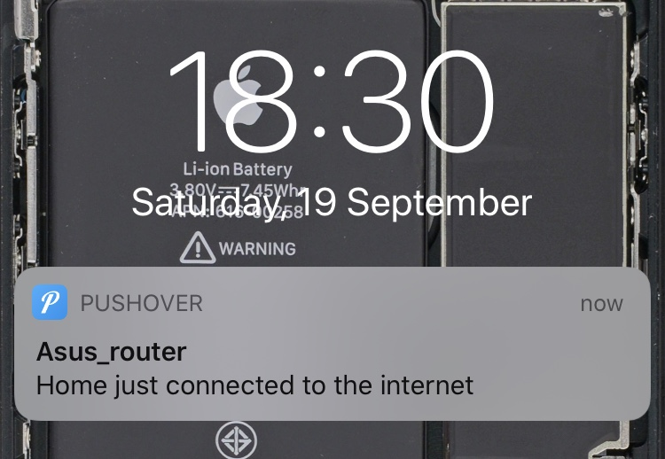
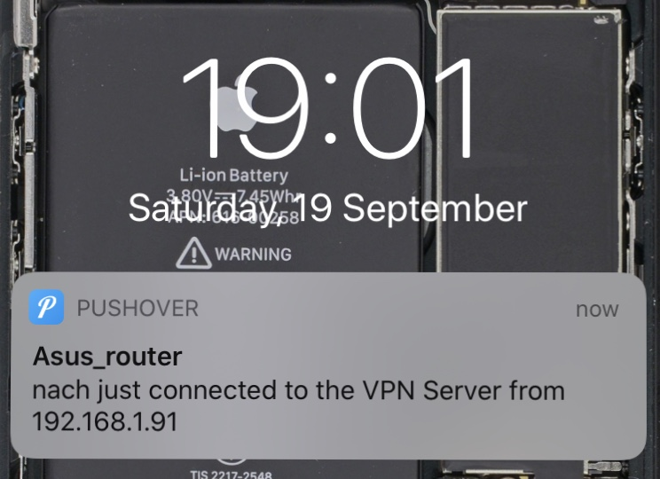

# Asuswrt-Merlin-Scripts
Miscellaneous Linux Shell Scripts developed for my personal Asuswrt-Merlin home router

# General Instructions

This scripts are targeted to be used on Asus routers running the modified [Asuswrt-Merlin](https://www.asuswrt-merlin.net/) software. To use this scripts you must first have.

1. [Enable SSH access](https://www.htpcguides.com/enable-ssh-asus-routers-without-ssh-keys/), If you want to acces via SSH throught the open internet (LAN + WAN) I **highly** recommend changing the port and disabling username password authentication (only using RSA keys).
2. Enable Custom Scripts. Go to Administration -> System -> Persistent JFFS2 partition and make sure that Enable JFFS custom scripts and configs is selected as "yes"

# Push Over

[Pushover](https://pushover.net/) is a service that enables to easily send Push Notifications to devices, I like it because by paying just once in a lifetime ($4.99 USD as of 2020) I get 7.500 free push notifications a month, more than enough for my personal needs. After installing the App on your smartphone, SSH in your router and create the file `/jffs/scripts/credentials.sh` with the following content:

```Shell
#!/bin/sh

export pushover_token="<Your pushover token goes here>"
export pushover_user="<Your pushover user goes here>"
```

# Get notified about firmware updates

It is very important to keep your router up to date with the latest firmware, this script will send you push notifications every time there's a new release. This script runs every 48 hrs.

```Shell
/usr/sbin/curl --retry 3 "https://raw.githubusercontent.com/ignaciohermosillacornejo/Asuswrt-Merlin-Scripts/master/update-notification" -o "/jffs/scripts/update-notification" && chmod 755 /jffs/scripts/update-notification && sh /jffs/scripts/update-notification
```

After running this command, you should see a push notification like the following on your smartphone




# Get notified when your router connects to the internet (WAN)

Sometimes your router disconects from the internet and you might not realize that, I like to have this notification as a record of all the times there's a problem with my ISP provider so that I can complain, record in hand.

```Shell
/usr/sbin/curl --retry 3 "https://raw.githubusercontent.com/ignaciohermosillacornejo/Asuswrt-Merlin-Scripts/master/wan-event" -o "/jffs/scripts/wan-event" && chmod 755 /jffs/scripts/wan-event && sh /jffs/scripts/wan-event 0 connected
```

After running this command, you should see a push notification like the following on your smartphone



# Get notified when someone connects to your VPN Server

One of my favourite things about my Asus Router is that it has the capability of running an OpenVPN Server, allowing me, my friends and I to connect to the internet safely from public wifi and have more privacy knowing that I'm not relying on any public VPN services or paying for them. I also know that I get really fast bandwith and fantastic ping times while state side.


```Shell
/usr/sbin/curl --retry 3 "https://raw.githubusercontent.com/ignaciohermosillacornejo/Asuswrt-Merlin-Scripts/master/vpn_client_connect.sh" -o "/jffs/scripts/vpn_client_connect.sh" && chmod 755 /jffs/scripts/vpn_client_connect.sh
```

After adding the script, go to VPN -> VPN Server -> VPN Details (change to advanced) and add this to the Custom Configuration box at the end:

```Shell
client-connect    /jffs/scripts/vpn_client_connect.sh
```

After waiting for a bit for the VPN Server to restart, every time someone connects to the VPN Server you should see the following on your smartphone




# Add your own scripts

What's been done here doesn't even scratch the surface of the posibilities that you can do with your scripts on your asus routers. If you're interested, checkout the  [official wiki](https://github.com/RMerl/asuswrt-merlin.ng/wiki/User-scripts) for more examples and documentation.
